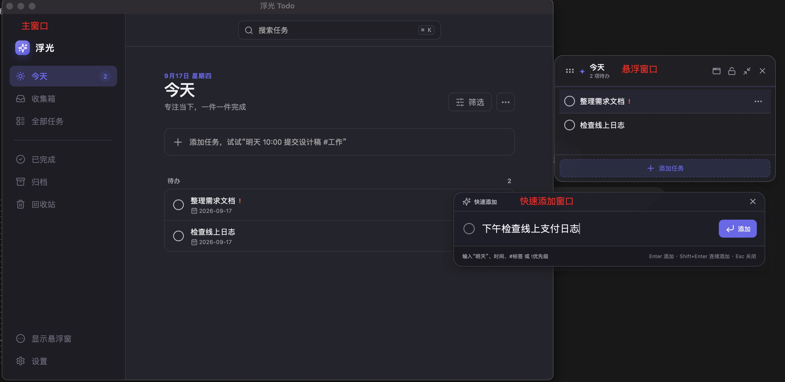
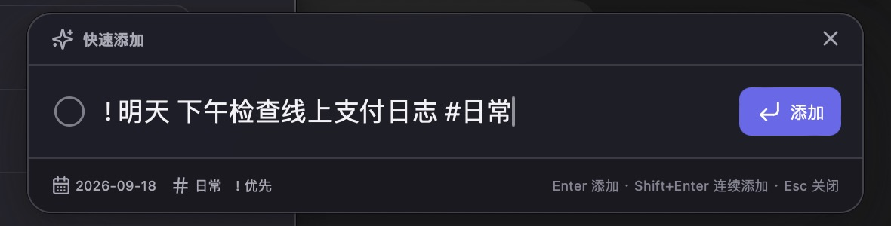
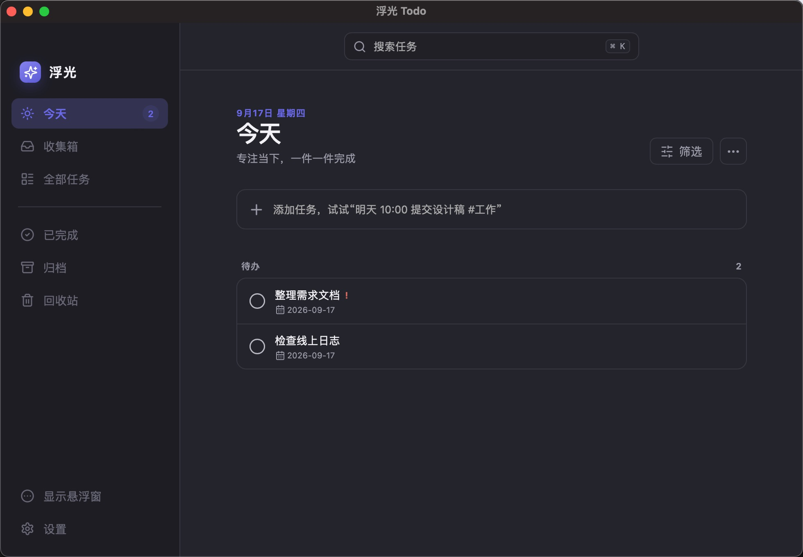
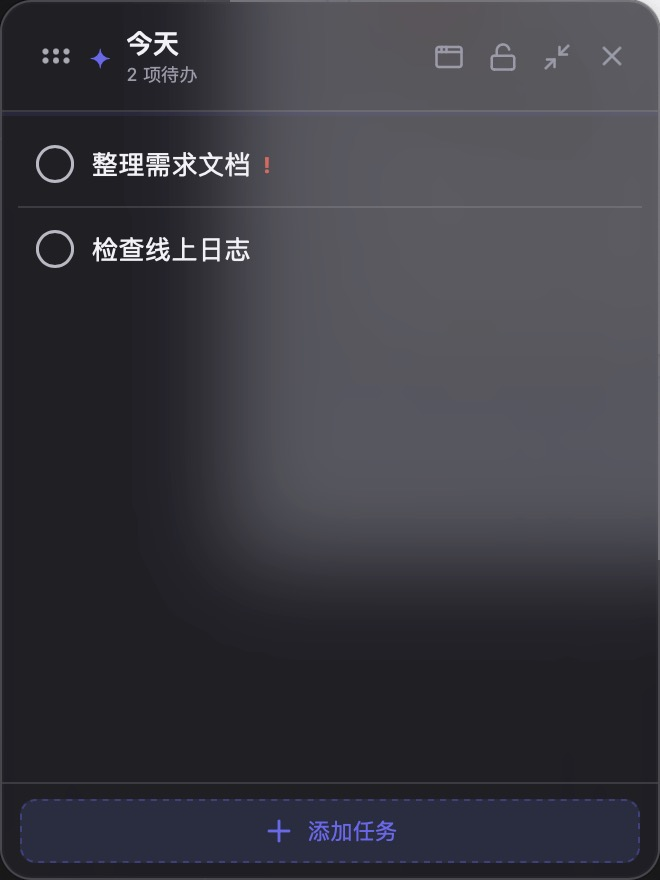

# 浮光 Todo

一款本地优先的 macOS 桌面 Todo，提供全局快速输入、半透明置顶悬浮窗、任务归类、筛选排序、归档回收站和 JSON 数据管理。



## 核心能力

- `⌘⇧Space`：从任意应用呼出快速添加窗口
- `⌘⇧T`：显示或隐藏悬浮窗
- `⌘⇧O`：打开主窗口
- `⌘⇧L`：关闭悬浮窗点击穿透并恢复交互
- 支持今天、收集箱、全部任务、已完成、归档和回收站
- 支持标题编辑、置顶、拖动排序、完成、恢复、归档和软删除
- 支持搜索、状态/优先级/置顶筛选，以及智能、创建时间、截止时间和标题排序
- 支持自然语言日期、时间、标签和优先级快捷语法
- 三个窗口共享同一份本地数据，并通过事件广播实时刷新

## 窗口行为

应用包含主窗口、快速添加窗口和悬浮窗。

- 启动应用时默认只显示悬浮窗，主窗口保持隐藏。
- 关闭主窗口或悬浮窗时实际执行隐藏，应用继续在后台和系统托盘中运行。
- 在 macOS Dock 中再次点击应用图标时，会恢复上一次关闭的主窗口或悬浮窗，而不是固定打开主窗口。
- 快速添加窗口打开或重新获得焦点时，会自动聚焦输入框，可直接输入。
- 系统托盘提供打开主窗口、快速添加、显示/隐藏悬浮窗和退出入口。
- Dock 图标使用带透明边距的圆角图标；托盘使用无背景的 macOS Template 图标，以适配浅色和深色菜单栏。
- 应用使用单实例锁，重复启动不会创建重叠的悬浮窗。

## 任务输入与自动归类

所有新增入口使用同一套解析和归类规则，包括主窗口、快速添加窗口和悬浮窗。

### 日期

当前支持以下日期表达：

- `今天`
- `明天`
- `后天`
- `周一`至`周日`
- `星期一`至`星期天`

归类规则：

- 输入中没有明确日期时，任务自动进入“收集箱”。
- 输入中包含明确日期时，任务成为已安排任务。
- 日期为当天的任务会出现在“今天”和悬浮窗中。
- 只输入时间但没有日期，例如 `10:00 开会`，仍归入收集箱。

示例：

```text
整理需求文档                    → 收集箱
10:00 开会                     → 收集箱
今天 10:00 开会                → 今天
明天 10:30 提交设计稿 #工作     → 明天的已安排任务
周五 发布版本 #发布             → 下一个周五的已安排任务
```

### 标签与优先级

- `#标签` 会从标题中提取，并支持多个标签和自动去重。
- 优先级写在输入开头，支持 `!`、`!!`、`!!!`。
- `!` 对应 P1 普通，`!!` 对应 P2 高，`!!!` 对应 P3 紧急。
- 优先级和标签不会改变任务进入收集箱还是已安排任务，归类只取决于是否识别到明确日期。

示例：

```text
!!! 今天 修复线上问题 #工作
!! 明天 提交设计稿 #设计 #重要
! 整理会议记录
```

快速添加窗口支持：



- `Enter`：添加任务并关闭窗口
- `Shift+Enter`：添加任务后保留窗口，继续输入
- `Esc`：隐藏窗口

## 收集箱与今天

- 收集箱展示所有 `status: inbox` 的未安排任务。
- 任务操作菜单支持“移到收集箱”。移动后会清除原计划日期、截止时间和提醒，避免残留日程。
- 收集箱任务的操作菜单支持“移到今天”。移动后任务会切换为进行中状态，并设置当天日期。
- 已移除旧的“快速添加到”全局设置，新增任务不再依赖默认列表，而是统一按输入中的日期自动归类。
- 从归档或回收站恢复任务时，会根据任务原有列表和日期恢复到收集箱或进行中状态。

## 主窗口

主窗口左侧提供任务视图导航，右侧提供搜索、筛选、排序和任务内容。



- “今天”页面可以按全部、仅待办或仅已完成筛选。
- 所有任务页面均可按优先级和是否置顶筛选。
- 排序支持智能排序、最近创建、截止时间和任务名称。
- 点击页面外部或按 `Esc` 会关闭筛选、排序菜单。
- 设置页面不展示顶部“搜索任务”输入框，但保留顶部窗口拖动区域和一致的页面布局。
- 左侧导航使用更紧凑的 `14px` 字号；右侧“筛选”和“清空”文字按钮同样使用 `14px` 字号。
- 主窗口不再展示没有实际功能的本地用户头像占位入口。

## 悬浮窗



- 悬浮窗展示当天全部未完成任务；紧凑模式只改变视觉密度，不再限制任务数量。
- 已完成任务可根据设置显示在可展开的“已完成”区域。
- 悬浮卡片使用单层玻璃背景和边框，避免透明窗口与内容容器形成双层边框。
- 顶部左侧拖动锚点用于移动窗口；锁定位置后锚点不可拖动。
- 顶部右侧提供打开主窗口、锁定/解锁、展开/收起和隐藏按钮。
- 收起悬浮窗后，左侧仍显示拖动锚点和标题，右侧操作按钮保持可用。
- 可配置始终置顶、背景透明度、紧凑模式和点击穿透。
- 点击穿透开启后，可使用 `⌘⇧L` 或悬浮窗菜单恢复交互。

## 完成、归档与回收站

- 完成任务后会进入“已完成”，并按照设置选择立即、第二天、7 天后或永不自动归档。
- 归档和回收站中的任务可以恢复。
- 删除属于软删除，任务会先进入回收站。
- 回收站提供“清空”按钮；点击后必须在二次确认弹窗中选择“确认清空”。
- 清空会永久删除回收站内的全部数据，操作完成后无法找回。
- 回收站为空时，“清空”按钮不可用。

## 本地数据与导入导出

桌面应用的数据文件位于应用数据目录：

```text
floating-todo.json
backups/
```

- 桌面应用以 Rust 侧原子写入的 JSON 文件作为持久化来源。
- Web 开发模式使用 `localStorage` 作为浏览器预览的持久化方案。
- “立即备份”会在 `backups/` 中创建带时间戳的 JSON 文件，最多保留最近 30 份手动备份。
- “导出 JSON”会先异步选择保存位置，再执行写入，避免阻塞界面。
- 导入和导出均校验数据版本、任务数组、任务 ID 和标题。
- 导入文件大小上限为 50 MB，当前仅支持 `version: 1`。

## 设置

设置页当前支持：

- 悬浮窗始终置顶
- 悬浮窗背景透明度
- 紧凑模式
- 点击穿透
- 快速添加、悬浮窗、主窗口快捷键
- 跟随系统、浅色、深色主题
- 已完成任务的自动归档策略
- 立即备份、导出 JSON、导入 JSON

快捷键修改后会重新注册。如果组合已被其他应用占用，应用会保留错误状态而不会崩溃。

## 开发

本项目使用 Vue 3、TypeScript、Pinia、Vite 和 Tauri 1。业务层与桌面运行时分离，后续可迁移到 Tauri 2。

```bas//
// git clone {地址}
pnpm install
pnpm test
pnpm build
pnpm tauri:dev
```

## 构建 macOS 应用

```bash
pnpm tauri:build
```

产物位于：

```text
src-tauri/target/release/bundle/macos/浮光 Todo.app
```

当前构建使用本地 ad-hoc 签名，未使用 Apple Developer ID，也未进行 Apple 公证，仅适合本机和内部测试。首次在其他 Mac 打开时，可能需要在 Finder 中右键应用并选择“打开”。
